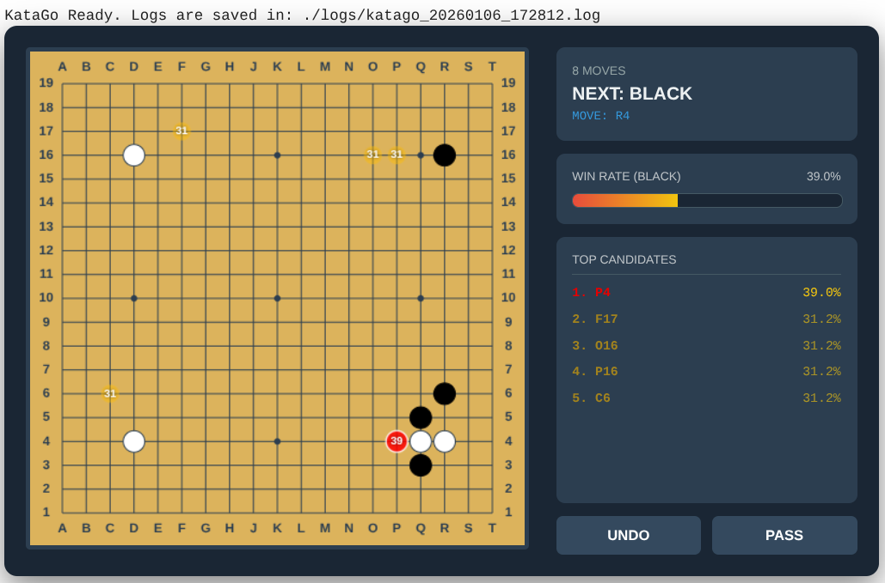

# katago-on-colab

KataGo を Google Colaboratory で簡単に動かすためのノートブックです。

## 日本語

### はじめに
KataGo を利用する際に GPU を利用したいことがあると思います。
GPU マシンを用意するのも、難しい設定を行うのも大変な場合があるため、Google Colaboratory で動作するようにしました。

単に動かすだけではなく、GUI で碁盤をクリックして操作できるようにしてあります。

### 事前設定
必ず Runtime の設定で GPU を選択してください。
L4 でも十分です。

### 使い方
基本的には上から下まで順番にセルを実行することで利用できるはずです。

---

## English

### Introduction
Run KataGo on Google Colaboratory with ease.
This project was created to help those who want to use KataGo with a GPU without the hassle of setting up a GPU machine or complex configurations.

It allows you not only to run KataGo but also to interact with it via a GUI where you can click on the Go board.

### Prerequisites
Please ensure you select **GPU** in the Runtime settings.
An L4 GPU is sufficient.

### Usage
Basically, you can use it by executing the cells in order from top to bottom.
